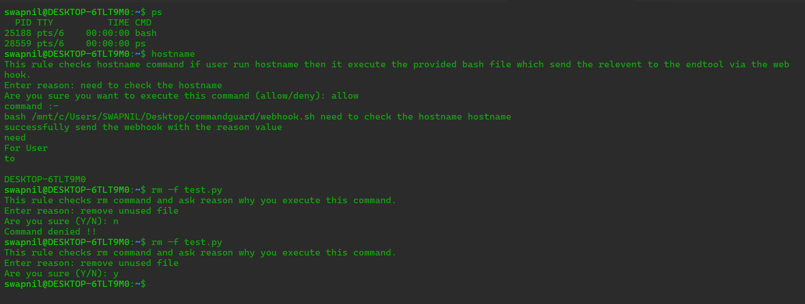

# 🛡️ CommandGuard

**CommandGuard** is a Linux command execution protection tool that prevents accidental or unauthorized execution of dangerous commands.

Linux executes every command instantly. A single mistake like `rm -rf /` can destroy a system.  
With **CommandGuard**, you define safety rules such as:

- ✔️ Ask permission before executing risky commands  
- ✔️ Require the user to provide a reason  
- ✔️ Block commands completely  
- ✔️ Allow only specific users to run certain commands  
- ✔️ Send alerts (Email, Slack, Webhooks, etc.)  
- ✔️ Customizable messages, prompts, and deny text  
- ✔️ Full command execution logging and debug mode  

This ensures that your team runs commands safely, with visibility and control.

---

# ✨ Features

- 🛑 Block sensitive commands  
- 🔐 Require confirmation before execution  
- 📝 Ask for a reason (audit trail)  
- 👥 User allowlist + fine-grained access control  
- 📡 Send command execution notifications  
- ⚙️ YAML configurable  
- 🐛 Debug mode for development  
- 🔎 Supports filters + exact command matching  

---

# 🚀 Installation Guide

Follow these steps to install CommandGuard.

---

## 1️⃣ Clone the Repository
```bash
git clone https://github.com/swapnilpatel2308/commandguard.git
cd commandguard
```

---

## 2️⃣ Create Required Directories
```bash
sudo mkdir -p /etc/commandguard
```

---

## 3️⃣ Install Binary & Config
```bash
sudo cp commandguard /etc/commandguard/
sudo chmod +x /etc/commandguard/commandguard

sudo cp command_guard.yaml /etc/commandguard/
```

---

## 4️⃣ Hook CommandGuard Into Shell

### Bash
Add this to your profile:
```bash
sudo cp command_guard.sh /etc/profile.d/
source /etc/profile.d/command_guard.sh
```

---

# ⚙️ Configuration File

The configuration file is stored at:

```
/etc/commandguard/command_guard.yaml
```

This file controls:

- Which commands to guard  
- What confirmation text appears  
- Whether the command should be blocked  
- Whether user must give a reason  
- Which users are allowed  
- Whether debug mode is enabled  
- Notification options  

---

# 📘 Configuration Reference Table

| Key | Type | Required | Description |
|------|--------|----------|-------------|
| **name** | string | Yes | Unique rule name. |
| **description** | string | Yes | What this rule protects. |
| **filter** | string | Yes | String or regex to match commands. |
| **input_prompt** | string | No | Message shown before asking confirmation. |
| **allow_input** | string | No | Expected input to allow execution (e.g., "YES"). |
| **reason_require** | bool | No | If true, user must provide a reason. |
| **reason_require_prompt** | string | No | Message asking for the reason. |
| **deny** | bool | No | If true, the command is blocked entirely. |
| **deny_prompt** | string | No | Text shown when a command is denied. |
| **enabled** | bool | No | Toggle rule on/off without removing it. |
| **not_allow_output_text** | string | No | Custom text when execution is denied. |
| **allowd_users** | []string | No | Users who can run this rule. default * |
| **commands** | []string | No | Exact command list only .sh script allowd this will execute the script once user confirm that this command run after this commands script's will run. |
| **command_output_debug** | bool | No | Id true then it will print the commands script output in terminal else it not print output in terminal. |

---

# 📦 Example Configuration

```yaml
- name: dangerous-delete-protection
  description: Prevent accidental deletion of critical directories
  filter: "rm -rf*"
  input_prompt: "⚠️ This is a dangerous command. Type YES to continue:"
  allow_input: "YES"
  reason_require: true
  reason_require_prompt: "Please provide the reason for executing this command:"
  deny: false
  enabled: true
  not_allow_output_text: "⛔ Command blocked by CommandGuard."
  allowd_users:
    - admin
    - devops
  commands:
    - bash /home/swapnil/send_email.sh
  command_output_debug: true
```
---

# 🏁 Output


---

# 🧠 Why Teams Use CommandGuard

| Problem | Solution |
|---------|----------|
| Accidental destructive commands | Permission prompts & deny rules |
| No visibility on risky actions | Reason logging & auditability |
| Junior developers making mistakes | User-specific restrictions |
| No alerts for sensitive actions | Slack/email/webhook notifications |
| Hard to enforce safe operations | Centralized YAML-configurable guard system |

---

# 🏁 Quick Start Steps

1. Install CommandGuard  
2. Configure rules in the YAML file  
3. Add shell hook to Bash
4. Test with commands like `rm -rf folder`  
5. Deploy across your team/servers  

---

# 🚀 Uninstall Guide

Follow these steps to uninstall CommandGuard.

---

```bash
sudo rm -f /etc/profile.d/command_guard.sh
sudo rm -rf /etc/commandguard
```

---

# 🤝 Improvement

Let me Know any enhancement and bug at @patelswapnil2308@gmail.com
